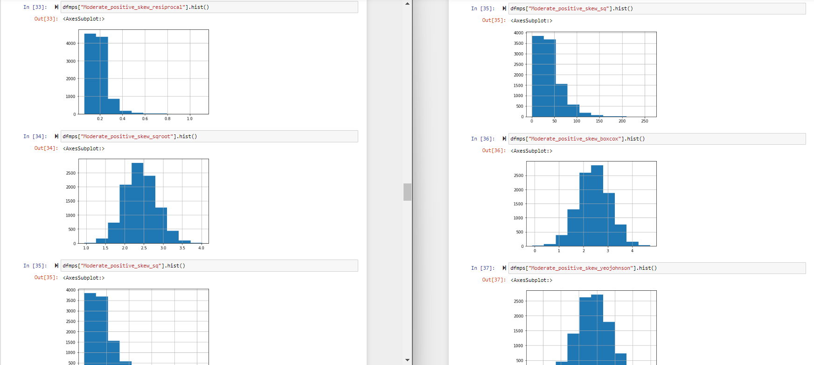

# EX-06-Feature-Transformation

## AIM
To Perform the various feature transformation techniques on a dataset and save the data to a file. 

# Explanation
Feature Transformation is a mathematical transformation in which we apply a mathematical formula to a particular column(feature) and transform the values which are useful for our further analysis.

# ALGORITHM
### STEP 1
Read the given Data
### STEP 2
Clean the Data Set using Data Cleaning Process
### STEP 3
Apply Feature Transformation techniques to all the feature of the data set
### STEP 4
Save the data to the file

# CODE:
# Data to transform:
```
import numpy as np
import pandas as pd 
import matplotlib.pyplot as plt
import seaborn as sns
import statsmodels.api as sm 
import scipy.stats as stats
from sklearn.preprocessing import QuantileTransformer
qt=QuantileTransformer(output_distribution="normal")

df=pd.read_csv("Data_to_Transform.csv")
df

df1=df.copy()

df1.isnull().sum()

df1.skew()

dfmps=pd.DataFrame()

dfmps["Moderate_positive_skew_log"]=np.log(df1["Moderate Positive Skew"])
dfmps

dfmps["Moderate_positive_skew_resiprocal"]=np.reciprocal(df1["Moderate Positive Skew"])
dfmps

dfmps["Moderate_positive_skew_sqroot"]=np.sqrt(df1["Moderate Positive Skew"])
dfmps

dfmps["Moderate_positive_skew_sq"]=np.square(df1["Moderate Positive Skew"])
dfmps

dfmps["Moderate_positive_skew_boxcox"], parameters=stats.boxcox(df1["Moderate Positive Skew"]) 
dfmps

dfmps["Moderate_positive_skew_yeojohnson"], parameters=stats.yeojohnson(df1["Moderate Positive Skew"]) 
dfmps

dfmps.skew()

dfhps=pd.DataFrame()

dfhps["Highly_positive_skew_log"]=np.log(df1["Highly Positive Skew"])
dfhps

dfhps["Highly_positive_skew_reciprocal"]=np.reciprocal(df1["Highly Positive Skew"])
dfhps

dfhps["Highly_positive_skew_sqroot"]=np.sqrt(df1["Highly Positive Skew"])
dfhps

dfhps["Highly_positive_skew_sq"]=np.square(df1["Highly Positive Skew"])
dfhps

dfhps["Highly_positive_skew_boxcox"], parameters=stats.boxcox(df1["Highly Positive Skew"]) 
dfhps

dfhps["Highly_positive_skew_yeojohnson"], parameters=stats.yeojohnson(df1["Highly Positive Skew"]) 
dfhps

dfhps.skew()

dfmns=pd.DataFrame()

dfmns["Moderate_Negative_skew_sqroot"]=np.square(df1["Moderate Negative Skew"])
dfmns

dfmns["Moderate_Negative_skew_rec"]=np.reciprocal(df1["Moderate Negative Skew"])
dfmns

dfmns["Moderate_Negative_skew_yj"],parameters=stats.yeojohnson(df1["Moderate Negative Skew"])
dfmns

dfmns.skew()

dfhns=pd.DataFrame()

dfhns["Highly_Negative_skew_sqroot"]=np.square(df1["Highly Negative Skew"])
dfhns

dfhns["Highly_Negative_skew_rec"]=np.reciprocal(df1["Highly Negative Skew"])
dfhns

dfhns["Highly_Negative_skew_yj"],parameters=stats.yeojohnson(df1["Highly Negative Skew"])
dfhns

dfhns.skew()

dfmps["Moderate_positive_skew_log"].hist()
dfmps["Moderate_positive_skew_resiprocal"].hist()
dfmps["Moderate_positive_skew_sqroot"].hist()
dfmps["Moderate_positive_skew_sq"].hist()
dfmps["Moderate_positive_skew_boxcox"].hist()
dfmps["Moderate_positive_skew_yeojohnson"].hist()
dfhps["Highly_positive_skew_log"].hist()
dfhps["Highly_positive_skew_reciprocal"].hist()
dfhps["Highly_positive_skew_sqroot"].hist()
dfhps["Highly_positive_skew_sq"].hist()
dfhps["Highly_positive_skew_boxcox"].hist()
dfhps["Highly_positive_skew_yeojohnson"].hist()
dfmns["Moderate_Negative_skew_sqroot"].hist()
dfmns["Moderate_Negative_skew_yj"].hist()
dfhns["Highly_Negative_skew_sqroot"].hist()
dfhns["Highly_Negative_skew_yj"].hist()

#Quantile tranformasion 
dfmps["MPSqt"]=qt.fit_transform(df1[["Moderate Positive Skew"]])

dfmps.skew()

sm.qqplot(df['Moderate Positive Skew'],line='45')
plt.show()

sm.qqplot(dfmps['MPSqt'],line='45')
plt.show()

dfhps["HPSqt"]=qt.fit_transform(df1[["Highly Positive Skew"]])

dfhps.skew()

sm.qqplot(df['Highly Positive Skew'],line='45')
plt.show()

sm.qqplot(dfhps['HPSqt'],line='45')
plt.show()

dfmns["MNSqt"]=qt.fit_transform(df[["Moderate Negative Skew"]])

dfmns.skew()

dfmns.drop("Moderate_Negative_skew_rec",axis=1,inplace=True)

sm.qqplot(df['Moderate Negative Skew'],line='45')
plt.show()

sm.qqplot(dfmns['MNSqt'],line='45')
plt.show()

dfhns["HNSqt"]=qt.fit_transform(df[["Highly Negative Skew"]])

dfhns.skew()

dfhns.drop("Highly_Negative_skew_rec",axis=1,inplace=True)

sm.qqplot(df['Highly Negative Skew'],line='45')
plt.show()

sm.qqplot(dfhns['HNSqt'],line='45')
plt.show()
```
# Titanic:
```
import numpy as np
import pandas as pd 
import matplotlib.pyplot as plt
import seaborn as sns
import statsmodels.api as sm 
import scipy.stats as stats
from sklearn.preprocessing import QuantileTransformer
qt=QuantileTransformer(output_distribution="normal")

df=pd.read_csv("titanic_dataset.csv")
df

df.isnull().sum()

df.drop('Cabin',axis=1,inplace=True)
df.drop('Name',axis=1,inplace=True)
df.drop('Ticket',axis=1,inplace=True)

df['Age']=df['Age'].fillna(df['Age'].median())
df['Embarked']=df['Embarked'].fillna(df['Embarked'].mode()[0])

df.isnull().sum()

from sklearn.preprocessing import OrdinalEncoder
embark=["C","S","Q"]
emb=OrdinalEncoder(categories=[embark])
df["Embarked"]=emb.fit_transform(df[["Embarked"]])

from category_encoders import BinaryEncoder
be=BinaryEncoder()
newdata=be.fit_transform(df[["Sex"]])
df["Sex"]=newdata
df


df["Age_1"]=qt.fit_transform(df[["Age"]])

df["Survived_qt"]=qt.fit_transform(df[["Survived"]])

df["Embarked_qt"]=qt.fit_transform(df[["Embarked"]])

df["Pclass_sq"]=np.square(df["Pclass"])

df["Pclass_qt"]=qt.fit_transform(df[["Pclass"]])

df["SibSp_yj"], parameters=stats.yeojohnson(df["SibSp"])

df["SibSp_qt"]=qt.fit_transform(df[["SibSp"]])

df["Parch_yj"], parameters=stats.yeojohnson(df["Parch"])

df["Parch_qt"]=qt.fit_transform(df[["Parch"]])

df["Fare_yj"], parameters=stats.yeojohnson(df["Fare"])

df["Fare_qt"]=qt.fit_transform(df[["Fare"]])

df["Sex_yj"], parameters=stats.yeojohnson(df["Sex"])

df["Sex_qt"]=qt.fit_transform(df[["Sex"]])

df.skew()

df.drop('Sex_yj',axis=1,inplace=True)
df.drop('Pclass_qt',axis=1,inplace=True)
df.drop('SibSp_qt',axis=1,inplace=True)
df.drop('Parch_qt',axis=1,inplace=True)
df.drop('Fare_qt',axis=1,inplace=True)

df.skew()

df["Sex"].hist()
df["Sex_qt"].hist()
df["SibSp"].hist()
df["SibSp_yj"].hist()
df["Parch"].hist()
df["Parch_yj"].hist()
df["Fare"].hist()
df["Fare_yj"].hist()
df["Pclass"].hist()
df["Pclass_sq"].hist()
```
# OUPUT:
# Data to transform:





# Titanic:


# RESULT:
The various feature transformation techniques has been performed on the given datasets and the data are saved to a file.